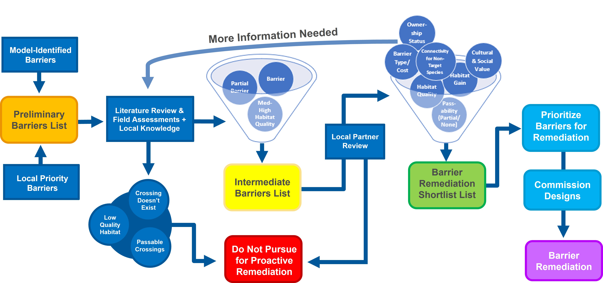

```{r setup, include=FALSE}
knitr::opts_chunk$set(echo = TRUE)
```

# Bulkley WCRP Barrier Lists {.tabset}

This tool provides an overview of the barrier prioritization analysis for the Bulkley River watershed, including incorporation of field assessment information. An overview of the iterative prioritization process used is provided in the figure below.

<center>

</center>

&nbsp;

The tool is divided into two sections, with separate maps and barrier tables under each tab:

- **Intermediate Barrier List**: This tab contains the barriers currently on the intermediate barrier list, i.e., those that are under consideration to pursue for proactive remediation. These barriers were discussed at the workshop on April 6, 2022.
- **Preliminary Barrier List**: This tab contains the barriers (and potential barriers) to fish passage that rank highly on the preliminary barrier list following an updated prioritization analysis that incorporated the results of the 2021 field season assessments.

This is a test version of the tool, so it isn't perfect. Apologies for any finicky functionality!

```{r streams_load, echo=FALSE, message = FALSE, warning=FALSE}

library(httr)
library(mapview)
library(jsonlite)
library(geojsonsf)
library(dplyr)
library(sf)
library(leafem)
library(leaflet)
library(kableExtra)

streams = st_read("./spatial/bulkley_streams.gpkg", quiet = TRUE)
barriers_all = st_read("./spatial/prelim_and_int_barriers.gpkg", quiet = TRUE)

barrier_sets = read.csv("./spatial/bulk_barrier_sets.csv")

barriers_all = merge(barriers_all, barrier_sets, by="aggregated_crossings_id")

int_barriers_list = barriers_all[barriers_all$int_list == 1,]

int_barriers_list_id = as_tibble(int_barriers_list) %>%
  dplyr::select(aggregated_crossings_id)

individual_crossings = barriers_all[barriers_all$barrier_set == 99 & barriers_all$int_list == 0,]


bulkley_river = barriers_all[barriers_all$barrier_set == 1,]

thompson_creek = barriers_all[barriers_all$barrier_set == 2,]

johnny_david_creek = barriers_all[barriers_all$barrier_set == 3,]

john_brown_creek = barriers_all[barriers_all$barrier_set == 4,]

driftwood_creek = barriers_all[barriers_all$barrier_set == 5,]

lemieux_creek = barriers_all[barriers_all$barrier_set == 6,]

stock_creek = barriers_all[barriers_all$barrier_set == 7,]

perow_creek = barriers_all[barriers_all$barrier_set == 8,]

robin_creek = barriers_all[barriers_all$barrier_set == 9,]

vallee_creek = barriers_all[barriers_all$barrier_set == 10,]

watson_creek = barriers_all[barriers_all$barrier_set == 11,]

gibson_creek = barriers_all[barriers_all$barrier_set == 12,]

coffin_creek = barriers_all[barriers_all$barrier_set == 13,]

graphite_creek = barriers_all[barriers_all$barrier_set == 14,]

```

## Intermediate Barrier List

### Overview

The barriers included in the map and barrier list below represent those that were discussed by the Bulkley River WCRP planning team during a workshop on April 6, 2022.

If you have any additional thoughts about any of the individual barriers or systems on the intermediate barrier list, please let us know!

### Intermediate Barrier List Map

A brief overview of how to use the map:

- The legend is on the **right side** of the map.
- The layers symbol in the **bottom right corner** allows you to switch the basemap, including to satellite imagery (the ``Esri.WorldImagery`` option).
- Hovering over a barrier point will display the ID that corresponds to the ``aggregated_crossing_id`` column in the barrier tables.
- Clicking on a barrier point will open a pop-up with the associated barrier attributes.
- Hovering over the stream lines will display the stream name (if applicable)

``` {r intermediate-map, echo=FALSE, message=FALSE, out.width = "100%", out.height = "750px"}

mapviewOptions(homebutton.pos = "bottomleft", layers.control.pos = "bottomright")

mapview(int_barriers_list, layer.name = "Intermediate Barriers List", col.regions = "red", alpha.regions = 1, label = "aggregated_crossings_id") + mapview(streams, layer.name = "Streams", alpha.regions = 1, label = "gnis_name")

```

### Intermediate Barrier List

Some barriers on his list are presented as having no spawning or rearing habitat upstream (``all_spawningrearing_belowupstrbarriers_km`` = 0). This represents the modelled habitat results, which are superseded by field assessment data. The model will be updated accordingly.

```{r intermediate_crossings_tbl, echo=FALSE, message = FALSE}

intermediate_crossings_tbl = as_tibble(int_barriers_list) %>%
  dplyr::select(-c(geometry,barrier_set,int_list)) %>%
  arrange(desc(all_spawningrearing_belowupstrbarriers_km))

kbl(intermediate_crossings_tbl) %>%
  kable_styling(fixed_thead=T,bootstrap_options = c("striped","hover")) %>%
  scroll_box(width = "950px", height = "500px")

int_summary = data.frame("Total Habitat Gain",sum(intermediate_crossings_tbl$all_spawningrearing_belowupstrbarriers_km))

kbl(int_summary, align = "c", col.names = NULL) %>%
  kable_styling(bootstrap_options = c("striped","hover"), full_width = F, position = "left")

```

## Preliminary Barrier List

### Overview

This sections contains information about the barriers (and potential barriers) to fish passage that rank highly on the preliminary barrier list for the Bulkley River watershed following the results of the 2021 field season assessments. These barriers are candidates to move forward for assessment, reassessment, or report review for the 2022 field season.

There are 75 barriers included under this section, not all will be selected or will be suitable candidates for the intermediate barrier list this year. More investigation is needed into individual and sets of barriers before the next suite of barriers is selected for field assessments, we know there are likely some errors in the data. However, we wanted to make sure that we got this draft list of barriers out for partner review prior to the second workshop session on April 12.

With that said, below is an interactive map and overviews of the barriers, and systems in which they are located, that currently rank highly on the preliminary barrier list. The barriers are divided into groupings in two ways:

1. **Individual barriers**: these are barriers that can be evaluated independently, they do not have any upstream or downstream barriers that need consideration. All individual barriers have been grouped into a single table under the ``Individual Barriers`` tab below.
2. **Sets of barriers**: these are systems that have multiple barriers located within them, and they can be considered for remediation as a group. Habitat gains can be expressed as the "gain per barrier". Barrier sets are grouped under tabs named after each system below.

If you have any thoughts about any of the individual barriers or systems, please let us know! Additionally, please let us know if there are any additional barriers that you think are local priorities that are missing from this list (and not part of the suite of already assessed we discussed at the last workshop), and we can add them to the intermediate list for field assessment.

### Preliminary Barrier List Map

This interactive map allows you to explore the barriers included in each of the tables below. They are grouped and colour-coordinated by system (except Individual Barriers, which are grouped together).

A brief overview of how to use the map:

- The legend is on the **right side** of the map.
- You can click on any of the "buttons" on the **left side** of the map to zoom to the barriers located in a given system.
- The layers symbol in the **bottom right corner** allows you to switch the basemap, including to satellite imagery (the ``Esri.WorldImagery`` option).
- Hovering over a barrier point will display the ID that corresponds to the ``aggregated_crossing_id`` column in the barrier tables.
- Clicking on a barrier point will open a pop-up with the associated barrier attributes.
- Hovering over the stream lines will display the stream name (if applicable)

``` {r individual-map, echo=FALSE, message=FALSE, out.width = "100%", out.height = "750px"}

mapviewOptions(homebutton.pos = "bottomleft", layers.control.pos = "bottomright")

mapview(individual_crossings, layer.name = "Individual Crossings", col.regions = "orange", alpha.regions = 1, label = "aggregated_crossings_id") + mapview(bulkley_river, layer.name = "Bulkley River/Taman Creek", col.regions = "black", alpha.regions = 1, label = "aggregated_crossings_id") + mapview(thompson_creek, layer.name = "Thompson Creek", col.regions = "grey", alpha.regions = 1, label = "aggregated_crossings_id") + mapview(johnny_david_creek, layer.name = "Johnny David Creek", col.regions = "purple", alpha.regions = 1, label = "aggregated_crossings_id") + mapview(john_brown_creek, layer.name = "John Brown Creek", col.regions = "#ffe400", alpha.regions = 1, label = "aggregated_crossings_id") + mapview(driftwood_creek, layer.name = "Driftwood Creek", col.regions = "#fb7069", alpha.regions = 1, label = "aggregated_crossings_id") + mapview(lemieux_creek, layer.name = "Lemieux Creek", col.regions = "#0b3039", alpha.regions = 1, label = "aggregated_crossings_id") + mapview(stock_creek, layer.name = "Stock Creek", col.regions = "#116445", alpha.regions = 1, label = "aggregated_crossings_id") + mapview(perow_creek, layer.name = "Perow Creek", col.regions = "#1aa98e", alpha.regions = 1, label = "aggregated_crossings_id") + mapview(robin_creek, layer.name = "Robin Creek", col.regions = "#fcaa8e", alpha.regions = 1, label = "aggregated_crossings_id") + mapview(vallee_creek, layer.name = "Vallee Creek", col.regions = "#aa1e12", alpha.regions = 1, label = "aggregated_crossings_id") + mapview(watson_creek, layer.name = "Watson Creek", col.regions = "#a0eaf9", alpha.regions = 1, label = "aggregated_crossings_id") + mapview(gibson_creek, layer.name = "Gibson Creek", col.regions = "#a09c63", alpha.regions = 1, label = "aggregated_crossings_id") + mapview(coffin_creek, layer.name = "Coffin Creek", col.regions = "#f2edb9", alpha.regions = 1, label = "aggregated_crossings_id") + mapview(graphite_creek, layer.name = "Graphite Creek", col.regions = "#99cc66", alpha.regions = 1, label = "aggregated_crossings_id") + mapview(streams, layer.name = "Streams", alpha.regions = 1, label = "gnis_name")

```

### Barrier Lists {.tabset}

Each of the tabs below contains the barrier lists for the individual crossings (first tab), and then the set of barriers for each system under subsequent tabs. Click on the tab you are interested in to pull up the associated barrier list. Some of these systems contain barriers that are already included on the intermediate barrier list -- these barriers are highlighted in red in each table (where applicable). The table for each set of barriers has a gain per barrier value at the bottom of the table.

#### Individual Barriers

##### Individual Barriers List

These are barriers that are not part of any barrier sets (i.e., there are no downstream barriers or upstream barriers with substantial gains). These crossings represent the individual barriers offering the most remaining potential habitat gains.

Barrier ``57876`` does not appear to fall on fish habitat.

```{r individual_crossings_tbl, echo=FALSE, message = FALSE}

individual_crossings_tbl = as_tibble(individual_crossings) %>%
  dplyr::select(-c(geometry,barrier_set)) %>%
  arrange(desc(all_spawningrearing_belowupstrbarriers_km))

kbl(individual_crossings_tbl) %>%
  kable_styling(fixed_thead=T,bootstrap_options = c("striped","hover")) %>%
  scroll_box(width = "950px", height = "500px")

```

&nbsp;

#### Bulkley River/Taman Creek

##### Bulkley River/Taman Creek Barrier List

```{r bulkley_crossings_tbl, echo=FALSE, message = FALSE}

bulkley_crossings_tbl = as_tibble(bulkley_river) %>%
  dplyr::select(-c(geometry,barrier_set)) %>%
  arrange(desc(barriers_anthropogenic_dnstr_count))

kbl(bulkley_crossings_tbl) %>%
  kable_styling(bootstrap_options = c("striped","hover")) %>%
  row_spec(which(bulkley_crossings_tbl$aggregated_crossings_id %in% int_barriers_list_id$aggregated_crossings_id), bold = T, color = "red") %>%
  scroll_box(width = "950px")

bulkley_summary = data.frame("Gain per barrier",sum(bulkley_crossings_tbl$all_spawningrearing_belowupstrbarriers_km)/nrow(bulkley_crossings_tbl))

kbl(bulkley_summary, align = "c", col.names = NULL) %>%
  kable_styling(bootstrap_options = c("striped","hover"), full_width = F, position = "left")

```

#### Thompson Creek

##### Thompson Creek Barrier List

```{r thompson_crossings_tbl, echo=FALSE, message = FALSE}

thompson_crossings_tbl = as_tibble(thompson_creek) %>%
  dplyr::select(-c(geometry,barrier_set)) %>%
  arrange(desc(barriers_anthropogenic_dnstr_count))

kbl(thompson_crossings_tbl) %>%
  kable_styling(bootstrap_options = c("striped","hover")) %>%
  row_spec(which(thompson_crossings_tbl$aggregated_crossings_id %in% int_barriers_list_id$aggregated_crossings_id), bold = T, color = "red") %>%
  scroll_box(width = "950px")

thompson_summary = data.frame("Gain per barrier",sum(thompson_crossings_tbl$all_spawningrearing_belowupstrbarriers_km)/nrow(thompson_crossings_tbl))

kbl(thompson_summary, align = "c", col.names = NULL) %>%
  kable_styling(bootstrap_options = c("striped","hover"), full_width = F, position = "left")

```

#### Johnny David Creek

##### Johnny David Creek Barrier List

```{r johnny_david_crossings_tbl, echo=FALSE, message = FALSE}

johnny_david_crossings_tbl = as_tibble(johnny_david_creek) %>%
  dplyr::select(-c(geometry,barrier_set)) %>%
  arrange(desc(barriers_anthropogenic_dnstr_count))

kbl(johnny_david_crossings_tbl) %>%
  kable_styling(bootstrap_options = c("striped","hover")) %>%
  row_spec(which(johnny_david_crossings_tbl$aggregated_crossings_id %in% int_barriers_list_id$aggregated_crossings_id), bold = T, color = "red") %>%
  scroll_box(width = "950px")

johnny_david_summary = data.frame("Gain per barrier",sum(johnny_david_crossings_tbl$all_spawningrearing_belowupstrbarriers_km)/nrow(johnny_david_crossings_tbl))

kbl(johnny_david_summary, align = "c", col.names = NULL) %>%
  kable_styling(bootstrap_options = c("striped","hover"), full_width = F, position = "left")

```

#### John Brown Creek

##### John Brown Creek Barrier List

Barrier ``198043`` appears to be a data error - the assessment information is linked to a powerline right-of-way, but the modelled crossing intersection is with the rail line. Imagery seems to indicate the rail crossing is likely a bridge.

```{r john_brown_crossings_tbl, echo=FALSE, message = FALSE}

john_brown_crossings_tbl = as_tibble(john_brown_creek) %>%
  dplyr::select(-c(geometry,barrier_set)) %>%
  arrange(desc(barriers_anthropogenic_dnstr_count))

kbl(john_brown_crossings_tbl) %>%
  kable_styling(bootstrap_options = c("striped","hover")) %>%
  row_spec(which(john_brown_crossings_tbl$aggregated_crossings_id %in% int_barriers_list_id$aggregated_crossings_id), bold = T, color = "red") %>%
  scroll_box(width = "950px")

john_brown_summary = data.frame("Gain per barrier",sum(john_brown_crossings_tbl$all_spawningrearing_belowupstrbarriers_km)/nrow(john_brown_crossings_tbl))

kbl(john_brown_summary, align = "c", col.names = NULL) %>%
  kable_styling(bootstrap_options = c("striped","hover"), full_width = F, position = "left")

```

#### Driftwood Creek

##### Driftwood Creek Barrier List

Barrier ``123699`` might be a good candidate for reassessment (last assessed in 2013) -- the crossing "scored" as a barrier, but the assessment comment indicated "no action required".

```{r driftwood_crossings_tbl, echo=FALSE, message = FALSE}

driftwood_crossings_tbl = as_tibble(driftwood_creek) %>%
  dplyr::select(-c(geometry,barrier_set)) %>%
  arrange(desc(barriers_anthropogenic_dnstr_count))

kbl(driftwood_crossings_tbl) %>%
  kable_styling(bootstrap_options = c("striped","hover")) %>%
  row_spec(which(driftwood_crossings_tbl$aggregated_crossings_id %in% int_barriers_list_id$aggregated_crossings_id), bold = T, color = "red") %>%
  scroll_box(width = "950px")

driftwood_summary = data.frame("Gain per barrier",sum(driftwood_crossings_tbl$all_spawningrearing_belowupstrbarriers_km)/nrow(driftwood_crossings_tbl))

kbl(driftwood_summary, align = "c", col.names = NULL) %>%
  kable_styling(bootstrap_options = c("striped","hover"), full_width = F, position = "left")

```

#### Lemieux Creek

##### Lemieux Creek Barrier List

```{r lemieux_crossings_tbl, echo=FALSE, message = FALSE}

lemieux_crossings_tbl = as_tibble(lemieux_creek) %>%
  dplyr::select(-c(geometry,barrier_set)) %>%
  arrange(desc(barriers_anthropogenic_dnstr_count))

kbl(lemieux_crossings_tbl) %>%
  kable_styling(bootstrap_options = c("striped","hover")) %>%
  row_spec(which(lemieux_crossings_tbl$aggregated_crossings_id %in% int_barriers_list_id$aggregated_crossings_id), bold = T, color = "red") %>%
  scroll_box(width = "950px")

lemieux_summary = data.frame("Gain per barrier",sum(lemieux_crossings_tbl$all_spawningrearing_belowupstrbarriers_km)/nrow(lemieux_crossings_tbl))

kbl(lemieux_summary, align = "c", col.names = NULL) %>%
  kable_styling(bootstrap_options = c("striped","hover"), full_width = F, position = "left")

```

#### Stock Creek

##### Stock Creek Barrier List

```{r stock_crossings_tbl, echo=FALSE, message = FALSE}

stock_crossings_tbl = as_tibble(stock_creek) %>%
  dplyr::select(-c(geometry,barrier_set)) %>%
  arrange(desc(barriers_anthropogenic_dnstr_count))

kbl(stock_crossings_tbl) %>%
  kable_styling(bootstrap_options = c("striped","hover")) %>%
  row_spec(which(stock_crossings_tbl$aggregated_crossings_id %in% int_barriers_list_id$aggregated_crossings_id), bold = T, color = "red") %>%
  scroll_box(width = "950px")

stock_summary = data.frame("Gain per barrier",sum(stock_crossings_tbl$all_spawningrearing_belowupstrbarriers_km)/nrow(stock_crossings_tbl))

kbl(stock_summary, align = "c", col.names = NULL) %>%
  kable_styling(bootstrap_options = c("striped","hover"), full_width = F, position = "left")

```

#### Perow Creek

##### Perow Creek Barrier List

```{r perow_crossings_tbl, echo=FALSE, message = FALSE}

perow_crossings_tbl = as_tibble(perow_creek) %>%
  dplyr::select(-c(geometry,barrier_set)) %>%
  arrange(desc(barriers_anthropogenic_dnstr_count))

kbl(perow_crossings_tbl) %>%
  kable_styling(bootstrap_options = c("striped","hover")) %>%
  row_spec(which(perow_crossings_tbl$aggregated_crossings_id %in% int_barriers_list_id$aggregated_crossings_id), bold = T, color = "red") %>%
  scroll_box(width = "950px")

perow_summary = data.frame("Gain per barrier",sum(perow_crossings_tbl$all_spawningrearing_belowupstrbarriers_km)/nrow(perow_crossings_tbl))

kbl(perow_summary, align = "c", col.names = NULL) %>%
  kable_styling(bootstrap_options = c("striped","hover"), full_width = F, position = "left")

```

#### Robin Creek

##### Robin Creek Barrier List

Includes barriers on de Jong Creek and Vanderven Creek (tributaries to Robin Creek).

```{r robin_crossings_tbl, echo=FALSE, message = FALSE}

robin_crossings_tbl = as_tibble(robin_creek) %>%
  dplyr::select(-c(geometry,barrier_set)) %>%
  arrange(desc(barriers_anthropogenic_dnstr_count))

kbl(robin_crossings_tbl) %>%
  kable_styling(bootstrap_options = c("striped","hover")) %>%
  row_spec(which(robin_crossings_tbl$aggregated_crossings_id %in% int_barriers_list_id$aggregated_crossings_id), bold = T, color = "red") %>%
  scroll_box(width = "950px")

robin_summary = data.frame("Gain per barrier",sum(robin_crossings_tbl$all_spawningrearing_belowupstrbarriers_km)/nrow(robin_crossings_tbl))

kbl(robin_summary, align = "c", col.names = NULL) %>%
  kable_styling(bootstrap_options = c("striped","hover"), full_width = F, position = "left")

```

#### Vallee Creek

##### Vallee Creek Barrier List


```{r vallee_crossings_tbl, echo=FALSE, message = FALSE}

vallee_crossings_tbl = as_tibble(vallee_creek) %>%
  dplyr::select(-c(geometry,barrier_set)) %>%
  arrange(desc(barriers_anthropogenic_dnstr_count))

kbl(vallee_crossings_tbl) %>%
  kable_styling(bootstrap_options = c("striped","hover")) %>%
  row_spec(which(vallee_crossings_tbl$aggregated_crossings_id %in% int_barriers_list_id$aggregated_crossings_id), bold = T, color = "red") %>%
  scroll_box(width = "950px")

vallee_summary = data.frame("Gain per barrier",sum(vallee_crossings_tbl$all_spawningrearing_belowupstrbarriers_km)/nrow(vallee_crossings_tbl))

kbl(vallee_summary, align = "c", col.names = NULL) %>%
  kable_styling(bootstrap_options = c("striped","hover"), full_width = F, position = "left")

```

#### Watson Creek

##### Watson Creek Barrier List

```{r watson_crossings_tbl, echo=FALSE, message = FALSE}

watson_crossings_tbl = as_tibble(watson_creek) %>%
  dplyr::select(-c(geometry,barrier_set)) %>%
  arrange(desc(barriers_anthropogenic_dnstr_count))

kbl(watson_crossings_tbl) %>%
  kable_styling(bootstrap_options = c("striped","hover")) %>%
  row_spec(which(watson_crossings_tbl$aggregated_crossings_id %in% int_barriers_list_id$aggregated_crossings_id), bold = T, color = "red") %>%
  scroll_box(width = "950px")

watson_summary = data.frame("Gain per barrier",sum(watson_crossings_tbl$all_spawningrearing_belowupstrbarriers_km)/nrow(watson_crossings_tbl))

kbl(watson_summary, align = "c", col.names = NULL) %>%
  kable_styling(bootstrap_options = c("striped","hover"), full_width = F, position = "left")

```

#### Gibson Creek

##### Gibson Creek Barrier List

```{r gibson_crossings_tbl, echo=FALSE, message = FALSE}

gibson_crossings_tbl = as_tibble(gibson_creek) %>%
  dplyr::select(-c(geometry,barrier_set)) %>%
  arrange(desc(barriers_anthropogenic_dnstr_count))

kbl(gibson_crossings_tbl) %>%
  kable_styling(bootstrap_options = c("striped","hover")) %>%
  row_spec(which(gibson_crossings_tbl$aggregated_crossings_id %in% int_barriers_list_id$aggregated_crossings_id), bold = T, color = "red") %>%
  scroll_box(width = "950px")

gibson_summary = data.frame("Gain per barrier",sum(gibson_crossings_tbl$all_spawningrearing_belowupstrbarriers_km)/nrow(gibson_crossings_tbl))

kbl(gibson_summary, align = "c", col.names = NULL) %>%
  kable_styling(bootstrap_options = c("striped","hover"), full_width = F, position = "left")

```

#### Coffin Creek

##### Coffin Creek Barrier List

```{r coffin_crossings_tbl, echo=FALSE, message = FALSE}

coffin_crossings_tbl = as_tibble(coffin_creek) %>%
  dplyr::select(-c(geometry,barrier_set)) %>%
  arrange(desc(barriers_anthropogenic_dnstr_count))

kbl(coffin_crossings_tbl) %>%
  kable_styling(bootstrap_options = c("striped","hover")) %>%
  row_spec(which(coffin_crossings_tbl$aggregated_crossings_id %in% int_barriers_list_id$aggregated_crossings_id), bold = T, color = "red") %>%
  scroll_box(width = "950px")

coffin_summary = data.frame("Gain per barrier",sum(coffin_crossings_tbl$all_spawningrearing_belowupstrbarriers_km)/nrow(coffin_crossings_tbl))

kbl(coffin_summary, align = "c", col.names = NULL) %>%
  kable_styling(bootstrap_options = c("striped","hover"), full_width = F, position = "left")

```

#### Graphite Creek

##### Graphite Creek Barrier List

When looking at imagery, it seems like dam ``1100002524`` might be associated with a pond that is not located on the main stream channel.

```{r graphite_crossings_tbl, echo=FALSE, message = FALSE}

graphite_crossings_tbl = as_tibble(graphite_creek) %>%
  dplyr::select(-c(geometry,barrier_set)) %>%
  arrange(desc(barriers_anthropogenic_dnstr_count))

kbl(graphite_crossings_tbl) %>%
  kable_styling(bootstrap_options = c("striped","hover")) %>%
  row_spec(which(graphite_crossings_tbl$aggregated_crossings_id %in% int_barriers_list_id$aggregated_crossings_id), bold = T, color = "red") %>%
  scroll_box(width = "950px")

graphite_summary = data.frame("Gain per barrier",sum(graphite_crossings_tbl$all_spawningrearing_belowupstrbarriers_km)/nrow(graphite_crossings_tbl))

kbl(graphite_summary, align = "c", col.names = NULL) %>%
  kable_styling(bootstrap_options = c("striped","hover"), full_width = F, position = "left")

```
